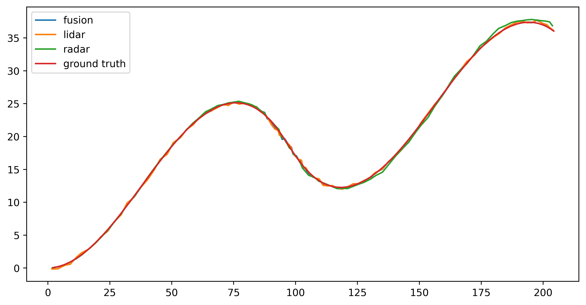

[](https://github.com/lh9171338/Outline) Sensor Fusion
===

# 简介
通过卡尔曼滤波、扩展卡尔曼滤波实现Lidar和Radar融合定位

# 依赖

- eigen3

# 结果

## 定位误差
| method | sensor | pos error | vel error |
| :---: | :---: | :---: | :---: |
| KF + EKF | L + R | 0.22 | 0.17 |
| KF + KF | L + R | 0.25 | 0.52 |
| EKF | L + R | 0.23 | 0.16 |
| KF | L | 0.26 | 0.25 |
| EKF | R | 0.28 | 0.17 |
| KF | R | 0.25 | 0.51 |

## 误差曲线

<p align="center">
    
</p>

# 终端运行

```shell
mkdir build && cd build
cmake ..
make -j8
./SensorFusion
```
